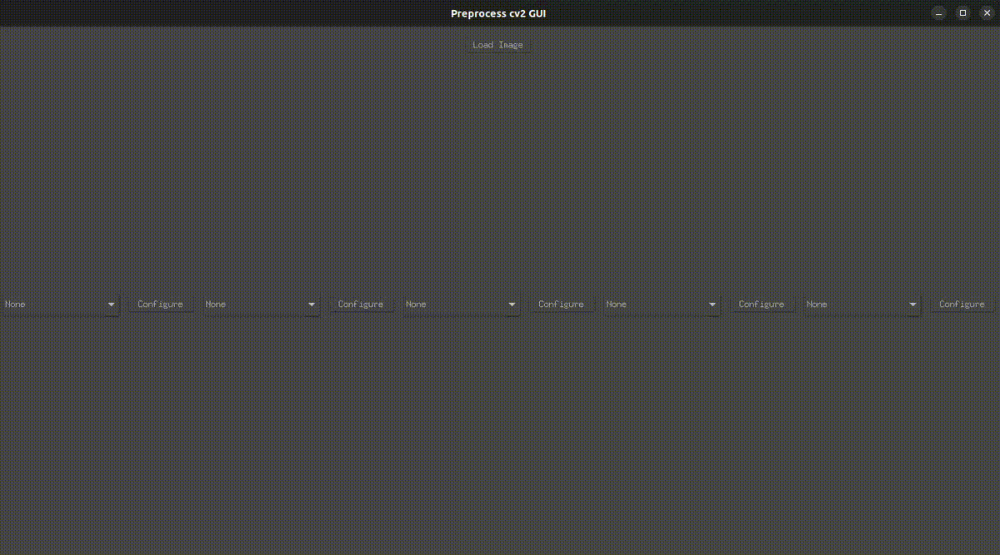

# preprocess-cv2-gui

Welcome to **preprocess-cv2-gui**! This application serves as a frontend to explore and test the most common preprocessing functionalities offered by cv2. It allows users to adjust the sequence and modify certain parameters to tailor the preprocessing steps to their needs. 

## Requirements

To ensure **preprocess-cv2-gui** runs smoothly, you'll need to have the following libraries installed:
- cv2
- tk
- ttkthemes
- PIL

Feel free to fork this repository and enhance it with new filters and features. Your contributions are highly encouraged!

Additionally, I've included a custom dialog class that you might find useful for creating a more powerful parameter editing experience. Although it's not utilized in the program, it's there for you to experiment with.

Hope you you find **preprocess-cv2-gui**  useful in your prepreocess testings. Cheers!
